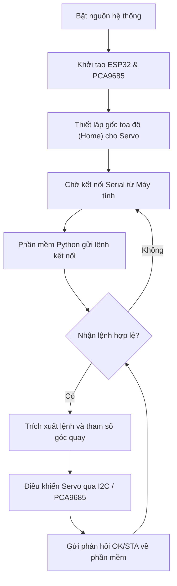
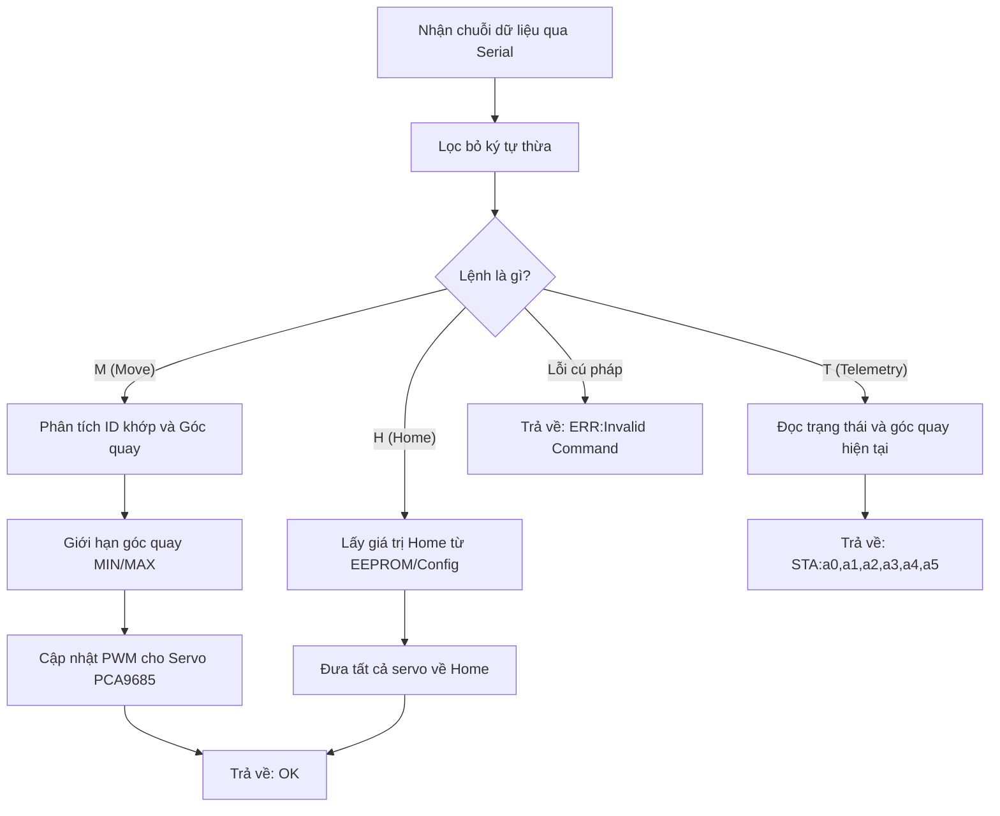

# Hệ Thống Điều Khiển Cánh Tay Robot 6 Bậc Tự Do (6-DOF Robot Arm)

Chào mừng đến với dự án mã nguồn mở **Robot Arm 6-DOF**. Dự án này bao gồm hai thành phần chính:
1. **Firmware (C++/PlatformIO)**: Chạy trên vi điều khiển ESP32, nhận lệnh qua Serial và điều khiển các động cơ Servo thông qua mạch PCA9685.
2. **Phần mềm điều khiển (Python/Tkinter GUI)**: Cung cấp giao diện trực quan cho phép người dùng điều khiển cánh tay robot trên máy tính.

---

## 🚀 Tính năng nổi bật
- Giao diện đồ họa (GUI) trực quan, thiết kế với Tkinter hỗ trợ cả chế độ sáng/tối.
- Kết nối tự động và giao tiếp ổn định qua cổng Serial.
- Hiển thị góc quay của các khớp, trạng thái hiện tại (idle, moving, error).
- Điều khiển từng khớp linh hoạt.
- Đồng bộ thông số từ phần cứng lên phần mềm ngay khi khởi động.

---

## 🛠 Hướng dẫn Cài đặt & Sử dụng

### 1. Cài đặt Firmware (ESP32)
Phần mềm nhúng được xây dựng trên nền tảng **PlatformIO**.

**Các bước cài đặt:**
1. Tải và cài đặt [Visual Studio Code](https://code.visualstudio.com/).
2. Cài đặt extension **PlatformIO IDE**.
3. Mở thư mục `firmware/` bằng VS Code.
4. Kết nối mạch ESP32 vào máy tính qua cáp USB.
5. Nhấn biểu tượng **Upload** (mũi tên chỉ sang phải) trên thanh trạng thái của PlatformIO để nạp code xuống ESP32.

### 2. Cài đặt Phần mềm giao diện (GUI)
Phần mềm điều khiển yêu cầu **Python 3.8+**.

**Các bước chạy GUI:**
1. Cài đặt môi trường ảo và thư viện (chạy trong Terminal tại thư mục `gui/`):
   ```bash
   python -m venv .venv
   .venv\Scripts\activate
   pip install -r requirements.txt
   ```
2. Mở phần mềm điều khiển:
   ```bash
   python main.py
   ```
3. Trên giao diện, chọn cổng COM tương ứng với ESP32 và nhấn **Connect**.
4. Sử dụng các thanh trượt hoặc nút nhấn trên giao diện để điều khiển các khớp (Joints) của cánh tay.

---

## 🧠 Lưu đồ Thuật toán

### 1. Lưu đồ hoạt động tổng thể của Hệ thống


### 2. Lưu đồ xử lý lệnh Serial của Firmware


---

## 📄 Cấu trúc Dự án

```text
RobotArm/
├── firmware/              # Mã nguồn C++ cho ESP32
│   ├── src/               # Thư mục mã nguồn chính (main.cpp, servo_ctrl.cpp, ...)
│   └── platformio.ini     # Tệp cấu hình biên dịch
├── gui/                   # Mã nguồn Python cho giao diện
│   ├── widgets/           # Các thành phần giao diện (UI Panels)
│   ├── config.py          # Tham số cấu hình ứng dụng
│   ├── main.py            # Entry point để chạy ứng dụng
│   ├── serial_comm.py     # Module giao tiếp Serial
│   └── requirements.txt   # Danh sách thư viện Python
└── README.md              # Tài liệu hướng dẫn sử dụng
```

## 🤝 Giấy phép (License)
Dự án được phân phối dưới giấy phép MIT. Bạn hoàn toàn có thể tự do sử dụng, chỉnh sửa và phân phối lại mã nguồn này.
